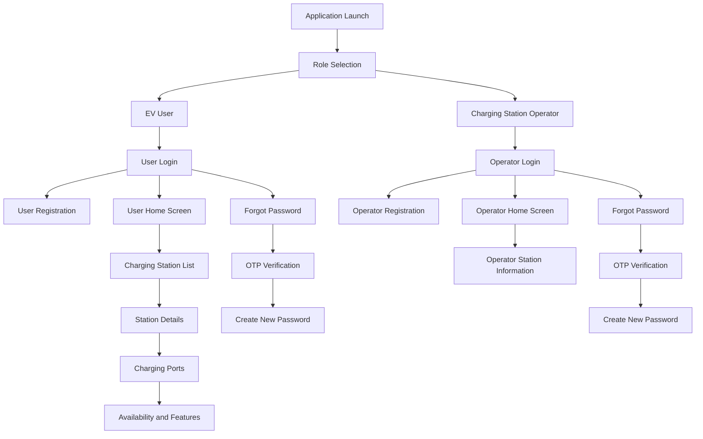
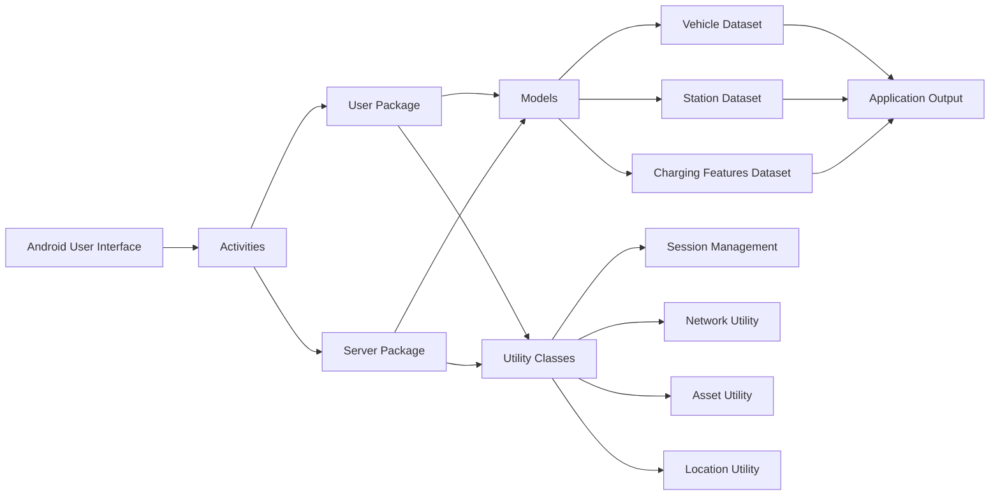
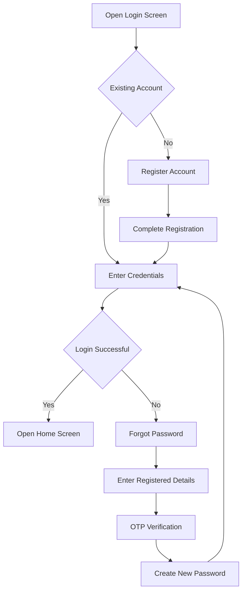
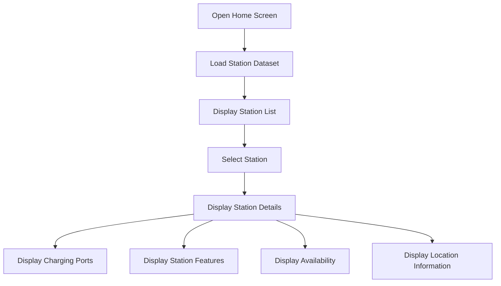

# EV Charging App

A smart Android-based EV charging station discovery and management application developed using Java, XML, Gradle and local JSON datasets.

The application supports two main user roles:

- EV User
- Charging Station Operator

The system allows users to:

- Register and log in
- Recover forgotten passwords
- Verify accounts using OTP
- View nearby charging stations
- Check charging-port details
- View station availability
- Access vehicle and charging-station information
- Use separate user and operator workflows

---

## Project Overview

Electric vehicle adoption is increasing rapidly, creating a greater need for accessible, reliable and easy-to-use charging infrastructure.

EV users often face difficulties such as:

- Finding nearby charging stations
- Identifying available charging ports
- Understanding connector information
- Viewing station details
- Managing login and account recovery
- Accessing organized EV-related data

This project develops a structured Android application that simplifies EV charging station discovery and management.

The application provides separate interfaces for EV users and charging-station operators.

The EV user section helps users view charging stations, station information, ports, availability and charging features.

The charging-station operator section provides a separate login and station-related workflow for operators.

The project can support:

- EV charging-station discovery
- Charging-port information access
- Station availability display
- EV-user account management
- Charging-station operator access
- Local vehicle and station data processing
- Future real-time charging integration
- Smart mobility application development

---

## Project Objectives

The main objectives of this project are:

1. Develop an Android application for EV charging station discovery.
2. Provide separate access for EV users and charging-station operators.
3. Support user and operator registration.
4. Provide secure login functionality.
5. Support forgot-password and OTP verification processes.
6. Display charging-station details.
7. Display charging-port and connector information.
8. Show station availability and charging features.
9. Organize vehicle and charging-station data using JSON files.
10. Maintain a clear Android project structure.
11. Support future map, payment and cloud integrations.
12. Provide a foundation for real-time EV charging management.

---

## Main Features

- EV user role selection
- Charging-station operator role selection
- User registration
- User login
- Operator registration
- Operator login
- Forgot-password functionality
- OTP verification
- New-password creation
- Charging-station listing
- Station-detail display
- Charging-port information
- Connector-detail display
- Station availability information
- EV feature display
- Vehicle dataset support
- Charging-station dataset support
- Separate user and operator activity flows
- Android resource-based user interface
- Gradle-based project configuration

---

## System Workflow

The complete application follows this process:

1. Launch the EV Charging App.
2. Display the role-selection screen.
3. Select EV User or Charging Station Operator.
4. Open the corresponding login screen.
5. Register a new account if required.
6. Enter login credentials.
7. Recover the password if the user cannot log in.
8. Verify the account using OTP.
9. Create a new password if required.
10. Open the corresponding home screen.
11. Load charging-station information.
12. Display charging-station listings.
13. Select a charging station.
14. Open the station-detail screen.
15. Display charging ports and connector information.
16. Display station availability and supported features.
17. Use the operator workflow for station-related functions.
18. Retrieve EV and station information from local JSON datasets.

---

## System Architecture



---

## Application Architecture



---

## Application Modules

The application contains the following major modules:

<div align="center">

| Module | Description |
|:---:|:---|
| Role Selection | Allows the user to choose EV User or Station Operator |
| Authentication | Handles login and registration |
| Password Recovery | Supports forgot-password and new-password creation |
| OTP Verification | Verifies the user or operator account |
| User Home | Displays EV-user-related functions |
| Operator Home | Displays charging-station operator functions |
| Station Listing | Displays available charging stations |
| Station Details | Shows detailed information about a selected station |
| Port Information | Displays charging-port and connector details |
| Feature Display | Shows charging-station features and availability |
| Local Data | Loads EV and charging-station information from JSON files |

</div>

---

## Technologies Used

<div align="center">

| Technology | Purpose |
|:---:|:---|
| Android Studio | Android application development |
| Java | Application logic and activity development |
| XML | User-interface layouts and resources |
| Gradle Kotlin DSL | Build and dependency management |
| Android SDK | Android platform support |
| JSON | Local vehicle and station datasets |
| Git | Version control |
| GitHub | Repository hosting and project documentation |

</div>

---

## Project Folder Structure

```text
Application/
├── app/
│   ├── build.gradle.kts
│   ├── proguard-rules.pro
│   └── src/
│       ├── androidTest/
│       ├── main/
│       │   ├── AndroidManifest.xml
│       │   ├── assets/
│       │   ├── java/
│       │   └── res/
│       └── test/
│
├── gradle/
│   ├── libs.versions.toml
│   └── wrapper/
│       ├── gradle-wrapper.jar
│       └── gradle-wrapper.properties
│
├── .gitattributes
├── .gitignore
├── build.gradle.kts
├── gradle.properties
├── gradlew
├── gradlew.bat
├── settings.gradle.kts
└── README.md
```

---

## Source-Code Organization

```text
app/src/main/java/com/example/evapp/
├── model/
├── server/
├── user/
├── util/
└── RoleSelectionActivity.java
```

The source code is divided into four main packages.

<div align="center">

| Package | Description |
|:---:|:---|
| `model` | Contains the application data classes |
| `server` | Contains charging-station operator activities |
| `user` | Contains EV-user activities and adapters |
| `util` | Contains reusable helper and utility classes |
| Root Package | Contains the role-selection activity |

</div>

---

## Model Classes

The model package contains the following data classes:

<div align="center">

| Model Class | Purpose |
|:---:|:---|
| Car | Stores electric vehicle information |
| ChargerPort | Stores charging-port information |
| ChargingSession | Stores charging-session information |
| Port | Represents a charging port |
| PortDetail | Stores detailed port information |
| PricingInfo | Stores charging-price information |
| Station | Stores charging-station information |
| Stationfeature | Stores station feature information |
| User | Stores user account information |

</div>

---

## EV User Activities

The EV-user package contains the following activities and components:

<div align="center">

| Component | Purpose |
|:---:|:---|
| LoginActivity | Handles EV-user login |
| SignUpActivity | Handles EV-user registration |
| ForgotPasswordActivity | Starts password recovery |
| OtpActivity | Handles OTP verification |
| NewPasswordActivity | Allows password creation |
| HomeActivity | Displays the EV-user home screen |
| StationDetailActivity | Displays station details |
| FeaturesActivity | Displays station features |
| StationAdapter | Displays station data in lists |
| StationInfoWindow | Displays station information |

</div>

---

## Charging Station Operator Activities

The charging-station operator package contains:

<div align="center">

| Component | Purpose |
|:---:|:---|
| LoginActivity_server | Handles operator login |
| SignUpActivity_server | Handles operator registration |
| ForgotPasswordActivity_server | Starts operator password recovery |
| OtpActivity_server | Handles operator OTP verification |
| NewPasswordActivity_server | Allows operator password creation |
| HomeActivity_server | Displays the operator home screen |
| StationDetailActivity_server | Displays operator station details |
| FeaturesActivity_server | Displays operator station features |
| StationAdapter_server | Displays station data for operators |

</div>

---

## Utility Classes

The utility package contains reusable helper classes.

<div align="center">

| Utility Class | Purpose |
|:---:|:---|
| ApiClient | Supports API-related communication |
| AssetUtils | Loads files from the assets folder |
| LocationUtils | Supports location-related operations |
| NetworkUtil | Checks or supports network operations |
| SafeDoubleTypeAdapter | Safely processes numeric values |
| SafeStringTypeAdapter | Safely processes text values |
| SessionManager | Manages user-session information |
| StationUtils | Provides station-related helper functions |
| TimeCalc | Performs time-related calculations |

</div>

---

## Application Datasets

The application uses local JSON datasets.

Dataset location:

```text
app/src/main/assets/
```

The main dataset files are:

```text
cars.json
ev_features.json
stations.json
stations_master.json
```

The datasets contain information such as:

- Electric vehicle details
- EV feature information
- Charging-station details
- Charging-port information
- Connector details
- Availability information
- Station features
- Station location information

These files are loaded by the Android application during runtime.

---

## Android Resources

The Android resource folder is located at:

```text
app/src/main/res/
```

It contains:

<div align="center">

| Resource Folder | Description |
|:---:|:---|
| drawable | Buttons, icons, backgrounds and UI shapes |
| layout | XML screen layouts |
| mipmap | Application launcher icons |
| values | Colors, strings and themes |
| values-night | Dark-theme configuration |
| xml | Backup, security and data-extraction configuration |

</div>

---

## User Interface Screens

The application includes screens for:

- Role selection
- User login
- User registration
- Operator login
- Operator registration
- Forgot password
- OTP verification
- New password
- User home
- Operator home
- Station details
- Charging-port details
- Station feature display
- Station information windows

---

## Authentication Flow



---

## Station Information Flow



---

## Build Requirements

The application requires:

<div align="center">

| Requirement | Description |
|:---:|:---|
| Android Studio | Required to open and run the project |
| Java Development Kit | Required for Java compilation |
| Android SDK | Required for Android builds |
| Gradle | Managed through the included Gradle wrapper |
| Android Device or Emulator | Required to run and test the application |
| Internet Connection | Required for initial dependency download |

</div>

---

## Opening the Project

Follow these steps:

1. Download or clone the repository.
2. Open Android Studio.
3. Select **Open**.
4. Choose the `Application` folder.
5. Wait for Gradle synchronization.
6. Allow Android Studio to download required dependencies.
7. Connect an Android device or open an emulator.
8. Click the Run button.

Open this folder:

```text
Application
```

Do not open only:

```text
Application/app
```

The `Application` folder is the complete Android Studio project root.

---

## Build from Terminal

### Windows

```bash
gradlew.bat assembleDebug
```

### Linux or macOS

```bash
./gradlew assembleDebug
```

The generated debug APK is normally available at:

```text
app/build/outputs/apk/debug/
```

---

## Testing

The project includes two testing folders:

```text
app/src/test/
app/src/androidTest/
```

<div align="center">

| Test Type | Location | Purpose |
|:---:|:---:|:---|
| Local Unit Test | `app/src/test/` | Tests Java logic locally |
| Instrumented Test | `app/src/androidTest/` | Tests the app on a device or emulator |

</div>

---

## Important Project Files

<div align="center">

| File | Purpose |
|:---:|:---|
| AndroidManifest.xml | Defines activities, permissions and application settings |
| build.gradle.kts | Defines project-level build configuration |
| app/build.gradle.kts | Defines app-level dependencies and Android settings |
| settings.gradle.kts | Registers the application module |
| gradle.properties | Stores Gradle-related settings |
| gradlew | Runs Gradle on Linux and macOS |
| gradlew.bat | Runs Gradle on Windows |
| .gitignore | Excludes generated and local files |
| .gitattributes | Defines Git file-handling rules |

</div>

---

## Files That Should Not Be Uploaded

The following generated files and folders should normally remain ignored:

```text
.gradle/
.idea/
build/
app/build/
local.properties
```

These files are automatically generated by Android Studio or Gradle.

---

## Future Enhancements

The application can be improved by adding:

- Real-time charging-station availability
- Google Maps integration
- Nearby-station search
- Turn-by-turn navigation
- Charging-slot reservation
- Online payment integration
- Charging-cost estimation
- Charging-session monitoring
- Charging-completion notifications
- QR-code-based charging access
- User reviews and station ratings
- Charging-history display
- Cloud database integration
- Real-time operator dashboard
- Vehicle-specific charging recommendations
- Route planning based on battery level
- Smart charging suggestions
- Energy-consumption analytics

---

## Development Guidelines

The following guidelines should be followed:

1. Keep Java files inside the correct package.
2. Keep XML layouts inside `app/src/main/res/layout/`.
3. Keep runtime JSON files inside `app/src/main/assets/`.
4. Do not remove the Gradle wrapper files.
5. Do not upload generated build folders.
6. Do not expose API keys, passwords or credentials.
7. Use meaningful class and file names.
8. Use clear Git commit messages.
9. Test changes before pushing them.
10. Keep the README updated when new features are added.

---

## Contribution Workflow

To contribute to the project:

```bash
git checkout -b feature/your-feature-name
git add .
git commit -m "Add new feature"
git push origin feature/your-feature-name
```

After pushing the new branch, create a pull request on GitHub.

---

## Author

**Karthik**

GitHub:

```text
https://github.com/karthik-190805
```

---

## Project Purpose

This Android application was developed as an educational and project-development initiative.

The project demonstrates:

- Android application development
- Java-based activity design
- XML user-interface development
- Role-based application flows
- Local JSON data processing
- EV charging-station information management
- Structured source-code organization
- GitHub-based project documentation

The application provides a foundation for future development of a complete real-time EV charging station discovery and management platform.

---

## Conclusion

The EV Charging App provides a structured Android-based solution for EV users and charging-station operators.

The current version supports role selection, authentication, OTP verification, charging-station information, port details, availability and local EV datasets.

Future versions can extend the project with maps, cloud services, live station data, payments, booking and smart charging analytics.
