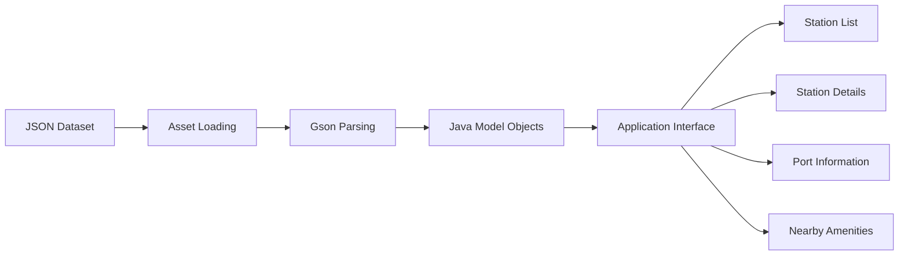

# EV Charging App Dataset

This folder contains the structured data files used by the **EV Charging App**.

The datasets support the application's offline demonstration mode by providing electric-vehicle information, charging-station details, charger-port specifications, station availability, and nearby amenity information.

---

## Dataset Overview

The EV Charging App is designed to support both:

1. **Live Mode**  
   Charging-station and nearby-place information can be retrieved from online services and APIs.

2. **Demo Mode**  
   Local JSON files are used to simulate API responses when internet access or live services are unavailable.

The files in this folder are intended mainly for the application's offline demonstration and testing workflow.

---

## Dataset Files

Recommended dataset structure:

```text
Dataset/
├── cars.json
├── ev_features.json
├── ports.json
├── stations.json
├── stations_master.json
└── README.md
```

> The exact files available may vary depending on the current application version.

---

## File Description

<div align="center">

| File | Description |
|:---:|:---|
| `cars.json` | Contains electric-vehicle information and charger compatibility details |
| `ev_features.json` | Contains charging-station features and nearby amenity information |
| `ports.json` | Contains charger-port and connector specifications |
| `stations.json` | Contains charging-station location and availability information |
| `stations_master.json` | Contains the consolidated or master charging-station dataset |

</div>

---

## Dataset Purpose

The datasets are used to support:

- Electric-vehicle model information
- Charger compatibility checking
- Charging-station discovery
- Station location display
- Charging-port information
- Connector specifications
- Power-rating information
- Availability status
- Nearby restaurants and pharmacies
- Offline application testing
- JSON parsing validation
- User-interface demonstration
- Future API integration

---

## Data Flow



---

## Use in the Android Application

The Android application uses runtime copies of the JSON files inside:

```text
Application/app/src/main/assets/
```

Example:

```text
Application/
└── app/
    └── src/
        └── main/
            └── assets/
                ├── cars.json
                ├── ev_features.json
                ├── stations.json
                └── stations_master.json
```

The files inside the root `Dataset/` folder are maintained for:

- Easy repository viewing
- Data documentation
- Dataset versioning
- Testing
- Research reference
- Future modification

The files inside `Application/app/src/main/assets/` are the copies used by the Android application during runtime.

---

## Data Format

The datasets are stored primarily in JSON format.

A typical JSON structure may look like:

```json
[
  {
    "name": "Sample Charging Station",
    "latitude": 13.0827,
    "longitude": 80.2707,
    "availability": true,
    "power_kw": 50
  }
]
```

The actual field names depend on the corresponding Java model classes and application logic.

---

## Data Categories

### Vehicle Data

Vehicle-related data may include:

- Manufacturer
- Model
- Battery capacity
- Supported connector type
- Charging compatibility
- Maximum charging power

### Charging Station Data

Station-related data may include:

- Station name
- Address
- Latitude
- Longitude
- Station type
- Availability status
- Number of charging points
- Operating hours
- Price per kWh
- Power rating

### Charging Port Data

Port-related data may include:

- Connector name
- Connector type
- Charging standard
- AC or DC classification
- Maximum power
- Voltage
- Current
- Vehicle compatibility

### Nearby Amenity Data

Amenity-related data may include:

- Restaurants
- Cafes
- Pharmacies
- Hospitals
- Rest areas
- Retail stores
- Distance from charging station
- Map and route information

---

## Dataset Usage Guidelines

1. Keep the JSON syntax valid.
2. Maintain consistent field names.
3. Do not remove required fields without updating the Java model classes.
4. Use UTF-8 encoding.
5. Keep latitude and longitude as numeric values.
6. Use valid Boolean values such as `true` and `false`.
7. Avoid duplicate station records.
8. Keep station identifiers unique where applicable.
9. Validate the data before copying it into the Android assets folder.
10. Update this README whenever a new dataset file is added.

---

## Updating the Dataset

When modifying a dataset:

1. Edit the required JSON file.
2. Validate the JSON structure.
3. Test the file using a JSON validator.
4. Copy the updated file into:

```text
Application/app/src/main/assets/
```

5. Open the application in Android Studio.
6. Run the application.
7. Confirm that the data loads correctly.
8. Commit both the dataset and application asset updates.

Example Git commands:

```bash
git add Dataset/
git add Application/app/src/main/assets/
git commit -m "Update EV charging datasets"
git push
```

---

## JSON Validation

Before uploading or using a modified dataset, confirm that:

- All opening braces have matching closing braces
- All opening brackets have matching closing brackets
- Property names are enclosed in double quotation marks
- String values are enclosed in double quotation marks
- Numeric values are not enclosed in quotation marks unless required
- There are no trailing commas
- The JSON file can be parsed successfully

---

## Data Safety

Do not include:

- Passwords
- API keys
- Access tokens
- Private user information
- Personal phone numbers
- Personal email addresses
- Payment information
- Confidential station-management data

Only public, sample, synthetic, or authorized project data should be stored in this folder.

---

## Future Dataset Enhancements

The dataset can be extended with:

- Real-time station occupancy
- Queue waiting time
- Charging price history
- User reviews
- Station ratings
- Vehicle-specific recommendations
- Route-based charging suggestions
- Energy-consumption information
- Charging-session history
- Reservation availability
- Renewable-energy percentage
- Payment-method support
- Accessibility information
- Maintenance status
- Smart-grid data

---

## Contribution

When adding a new dataset:

1. Use a clear filename.
2. Add a description to this README.
3. Document the main fields.
4. Confirm that the Android application can read the file.
5. Avoid uploading unnecessary or sensitive information.

---

## Project Repository

The Dataset folder is part of the:

```text
EV-Charging-App
```

GitHub repository maintained by:

**Karthik**

```text
https://github.com/karthik-190805
```

---

## Note

This dataset is intended for educational, demonstration, testing, and project-development purposes.

It provides a structured offline data source for the EV Charging App and creates a foundation for future real-time cloud and API integration.
