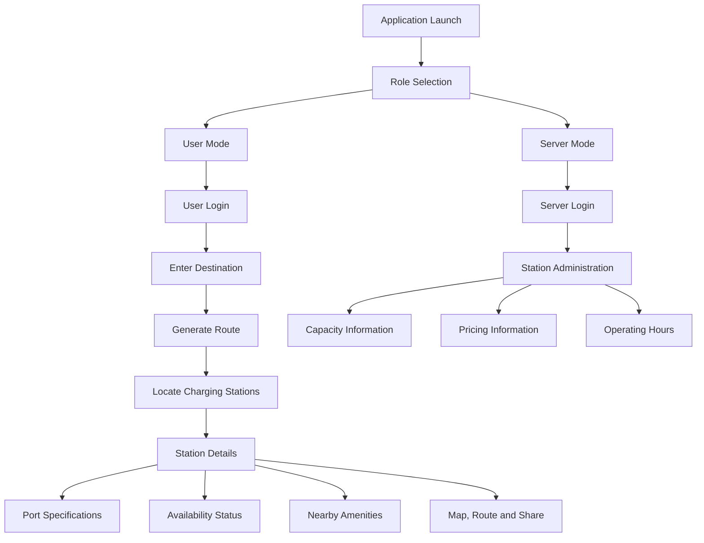
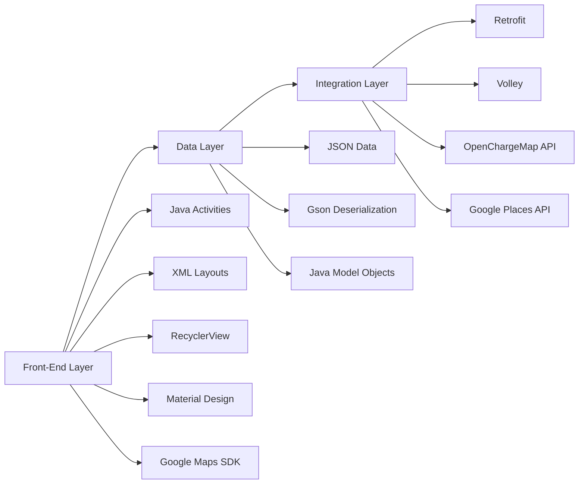
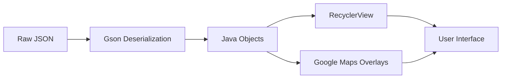
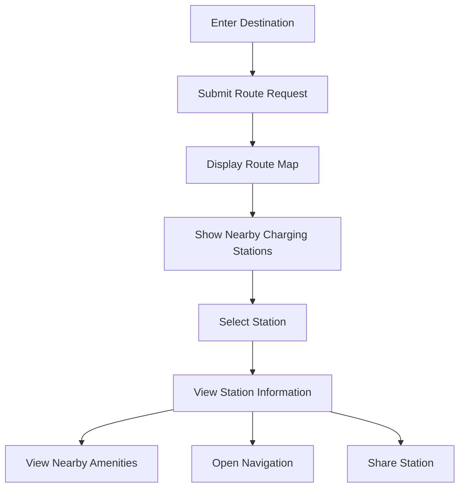

# Mobile Application to Locate Charging Stations for Electric Vehicles

A smart Android application developed to help electric-vehicle users locate charging stations, view charger specifications, identify nearby amenities, and access route-related information through both online and offline operating modes.

The application is developed using **Java and XML in Android Studio** and follows a modular architecture that supports local JSON-based demonstration as well as future live API integration.

---

## Project Overview

The increasing adoption of electric vehicles has created a strong need for accessible and reliable charging infrastructure.

EV users often require more than the location of a charging station. They may also need information such as:

- Charger type
- Charging power
- Port compatibility
- Station availability
- Expected waiting time
- Pricing information
- Operating hours
- Nearby restaurants
- Nearby pharmacies
- Route and navigation support

This project addresses that need through an Android-based EV charging station companion application.

The current prototype uses structured local JSON datasets to simulate cloud API responses while maintaining a design that can later support live online data.

---

## Project Objectives

The main objectives of this project are:

1. Help EV users locate charging stations.
2. Display charging-station specifications.
3. Show station availability and charger information.
4. Provide route-related charging-station suggestions.
5. Display nearby amenities such as restaurants and pharmacies.
6. Support separate user and charging-station administrator access.
7. Operate in both live and offline demonstration modes.
8. Maintain a scalable modular Android architecture.
9. Support future cloud, booking, payment and recommendation features.
10. Improve the accessibility of EV charging infrastructure.

---

## Main Features

- User and server role selection
- User login and registration
- Separate charging-station administrator access
- Destination-based charging-station search
- Charging stations displayed along the selected route
- Charging-station detail view
- Latitude and longitude display
- Charging-point information
- Charger port specifications
- Availability status
- Operating-hour information
- Charging price information
- Nearby restaurant and pharmacy information
- External map navigation
- Route viewing
- Station-information sharing
- Online and offline operating modes
- Local JSON dataset simulation
- Google Maps integration
- Modular application design

---

## Operating Modes

### Live Mode

The planned live mode retrieves current charging-station and nearby-place information using external APIs.

Live data sources include:

- **OpenChargeMap API**
  - Charging-station locations
  - Latitude and longitude
  - Charger types
  - Power ratings
  - Operational status
  - Station comments and metadata

- **Google Places API**
  - Restaurants
  - Cafes
  - Rest areas
  - Hospitals
  - Retail locations
  - Nearby amenities

### Demo Mode

The demo mode uses local structured JSON files to simulate live cloud responses.

The local datasets include information such as:

```text
ev_features.json
ports.json
cars.json
```

This allows the front-end workflow to be demonstrated without requiring continuous network access.

---

## System Workflow

The application follows this process:

1. Launch the application.
2. Select either User or Server mode.
3. Log in using the selected role.
4. Enter or select a destination.
5. Use the current location as the starting point if required.
6. Generate a route.
7. Display charging stations located along or near the route.
8. Select a charging station.
9. View station details.
10. View charger and port specifications.
11. Check station availability.
12. View nearby amenities.
13. Open the station in Google Maps.
14. View the route to the selected station.
15. Share station information using supported applications.
16. In Server mode, monitor station capacity, price and operating hours.

---

## System Architecture



---

## Three-Layer Architecture

The application follows a three-layer modular architecture.



---

## Architecture Layers

### Front-End Layer

The front-end is developed using Java and XML in Android Studio.

It uses:

- RecyclerView
- CardView
- FloatingActionButton
- ConstraintLayout
- Material Design components
- Google Maps SDK for Android
- Custom markers
- Map pop-ups
- External navigation intents
- Sharing intents

### Data Layer

The data layer uses structured JSON data.

Gson is used to:

- Parse JSON data
- Convert JSON into Java objects
- Support type-safe data handling
- Process local and online responses
- Maintain reusable data models

### Integration Layer

The integration layer is designed to support asynchronous communication.

It uses or plans to use:

- Retrofit
- OkHttp
- Volley
- REST APIs
- Request queuing
- Response caching
- Retry logic
- Background network execution

---

## JSON Processing Workflow



The JSON workflow includes:

1. Reading raw JSON from an API response or local asset file.
2. Converting JSON into Java objects using Gson.
3. Binding the processed data to lists, station cards or map overlays.

---

## Technologies Used

<div align="center">

| Technology | Purpose |
|:---:|:---|
| Android Studio | Android application development |
| Java | Application logic |
| XML | User-interface design |
| Google Maps SDK | Map display and station visualization |
| OpenChargeMap API | Live charging-station information |
| Google Places API | Nearby amenity information |
| Gson | JSON deserialization |
| Retrofit | Planned REST API communication |
| OkHttp | HTTP connection management |
| Volley | Request scheduling and caching |
| RecyclerView | Efficient list rendering |
| Material Design | Modern Android interface components |
| JSON | Offline demonstration datasets |
| Git and GitHub | Version control and repository hosting |

</div>

---

## Application Components

<div align="center">

| Component | Description |
|:---:|:---|
| Role Selection | Allows selection between User and Server |
| User Login | Provides EV-user access |
| Server Login | Provides station-administrator access |
| Route Input | Accepts destination and starting location |
| Station Search | Displays charging stations along the route |
| Station Details | Displays station name, coordinates and charging information |
| Features View | Displays availability and nearby amenities |
| Navigation | Opens the selected station in Google Maps |
| Sharing | Shares station information through external applications |
| Server Dashboard | Allows monitoring of capacity, operating hours and pricing |

</div>

---

## User Interaction Flow



The application also supports Android intents for:

- Opening Google Maps
- Passing destination coordinates
- Sharing station details through messaging, email or social applications

---

## Testing and Validation

The prototype was tested using both an emulator and a physical Android device.

### Emulator Testing

<div align="center">

| Item | Details |
|:---:|:---|
| Platform | Android Studio Emulator |
| Virtual Device | Pixel 5 profile |
| RAM | 4 GB |
| CPU Emulation | 2.84 GHz |
| Test Scope | UI rendering, JSON parsing, map markers and intent handling |

</div>

### Physical Device Testing

<div align="center">

| Item | Details |
|:---:|:---|
| Device | OnePlus Nord CE3 Lite |
| Test Scope | Real-world performance, GPS, network latency and battery use |

</div>

### Reported Performance

<div align="center">

| Metric | Reported Result |
|:---:|:---|
| Mean end-to-end response time | Approximately 1.5 seconds |
| Average data load time | Approximately 1.2 seconds |
| App no-crash reliability | 98.7% |
| Queue-status accuracy | 92% |
| Overall usable accuracy | Approximately 90% or more |
| Average GPS accuracy | Approximately ±6 km |

</div>

> These results represent the prototype testing conditions described in the project report.

---

## Results

The prototype successfully demonstrated:

- Separate User and Server login options
- Destination entry
- Route generation
- Charging stations displayed along the selected route
- Station-detail viewing
- Nearby restaurant and pharmacy information
- Map navigation
- Sharing functionality
- Server-side station capacity monitoring
- Server-side operating-hour monitoring
- Server-side charging-price monitoring

The application was able to display information accurately based on the datasets used during testing.

---

## Development Challenges

The main development challenges included:

- API rate limitations
- Inconsistent JSON structures
- GPS accuracy variation
- Large data volumes
- User-interface rendering performance
- Network dependency
- Failed map intents on some devices
- Compatibility across different Android configurations

---

## Mitigation Strategies

The project addressed these challenges using:

- Offline JSON fallback
- Exponential-backoff retry logic
- Gson `@SerializedName` annotations
- Custom Gson type adapters
- Asynchronous data loading
- Local caching
- Name-based station matching
- Web-based navigation fallback
- Modular architecture
- Independent module testing

---

## Future Enhancements

The application can be extended with:

- Full cloud deployment
- Real-time charging-station availability
- Firebase Realtime Database
- Custom backend services
- Improved charger-type filters
- Power-rating filters
- User preference storage
- Personalized charging recommendations
- Push notifications
- Charging-slot booking
- UPI payment integration
- Machine-learning recommendation engine
- Availability prediction
- Waiting-time prediction
- Smart-grid integration
- Route-aware charging suggestions
- Real-time station occupancy
- Advanced administrator dashboard

---

## Repository Structure

A recommended repository structure is:

```text
EV-Charging-App/
├── Application/
├── Dataset/
├── Documentation/
├── Screenshots/
├── Demo/
├── Testing/
├── Reports/
├── Presentation/
├── LICENSE
├── README.md
└── .gitignore
```

### Folder Purpose

<div align="center">

| Folder | Purpose |
|:---:|:---|
| Application | Complete Android Studio project |
| Dataset | JSON, CSV or Excel data files |
| Documentation | Architecture, setup and user documentation |
| Screenshots | Application interface images |
| Demo | Demo video, APK or sample output |
| Testing | Test cases and validation results |
| Reports | Final report and related documents |
| Presentation | Project presentation files |

</div>

---

## Getting Started

### Clone the Repository

```bash
git clone https://github.com/karthik-190805/EV-Charging-App.git
```

### Open the Android Project

1. Open Android Studio.
2. Select **Open**.
3. Choose the `Application` folder.
4. Wait for Gradle synchronization.
5. Start an emulator or connect a physical device.
6. Click **Run**.

---

## Build from Terminal

### Windows

```bash
gradlew.bat assembleDebug
```

### Linux or macOS

```bash
./gradlew assembleDebug
```

The generated debug APK is normally available at:

```text
Application/app/build/outputs/apk/debug/
```

---

## Screenshots

Add application screenshots inside:

```text
Screenshots/
```

Recommended screenshots:

- Role-selection screen
- User-login screen
- Route-selection screen
- Charging-station list
- Station-detail screen
- Nearby-amenities screen
- Server dashboard
- Pricing and operating-hour screen

Example Markdown:

```markdown


```

---

## Authors

- **S. Angalaeswari**
- **K. Karthik**
- **C. Krishna**
- **S. V. Sriram**

School of Electrical Engineering  
Vellore Institute of Technology, Chennai, India

---

## Publication

**Title:** Mobile Application to Locate Charging Stations for Electric Vehicles and Highlight Its Specifications

**Journal:** Results in Engineering  
**Volume:** 25  
**Year:** 2025  
**Article Number:** 104050

---

## Citation

```bibtex
@article{angalaeswari2025evcharging,
  title   = {Mobile Application to Locate Charging Stations for Electric Vehicles and Highlight Its Specifications},
  author  = {Angalaeswari, S. and Karthik, K. and Krishna, C. and Sriram, S. V.},
  journal = {Results in Engineering},
  volume  = {25},
  pages   = {104050},
  year    = {2025}
}
```

---

## Conclusion

This project demonstrates a practical and scalable Android solution for improving EV charging accessibility.

By combining charging-station discovery, route information, charger specifications, nearby amenities and administrator access in a single application, the project establishes a foundation for a reliable smart-mobility platform.

Future development can extend the prototype into a complete cloud-connected EV charging ecosystem with live station data, bookings, payments, notifications and intelligent charging recommendations.
