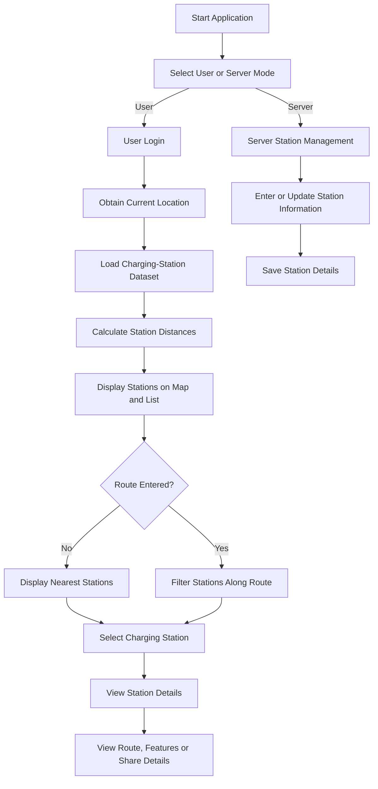

# EV Charging Port Tracking System

The **EV Charging Port Tracking System** is an Android application developed to help electric vehicle users locate nearby charging stations, check charging-port information and identify stations available along a selected route.

The application displays charging stations using Google Maps and arranges them based on the user’s current location. Users can view station availability, charger type, pricing, operating hours, distance, ratings and other useful station information.

---

## Objectives

- Locate nearby EV charging stations.
- Display charging stations on an interactive map.
- Sort stations according to distance from the user.
- Find charging stations along a selected route.
- Display charging-port availability and station details.
- Provide navigation to the selected charging station.
- Allow users to share charging-station information.
- Provide separate User and Server modes.

---

## Main Features

### User and Server Selection

The application provides two modes:

- **User Mode** – Used to search for and view EV charging stations.
- **Server Mode** – Used by the station administrator to manage station information.

### User Authentication

Users can log in using:

- Email address
- Phone number
- Username
- Password

The application also provides options for new user registration and password recovery.

### Interactive Map

Google Maps is used to display charging stations using markers.

- Green markers represent individual charging stations.
- Clustered markers display the number of stations available in a particular area.
- Users can select a marker to view the corresponding station information.

### Nearby Station Search

When no destination is entered, the application:

1. Obtains the user’s current GPS location.
2. Calculates the distance to each charging station.
3. Sorts the stations from nearest to farthest.
4. Displays the nearest stations on the map and in a list.

### Route-Based Station Filtering

The user can enter a start location and destination.

The application then displays charging stations located within approximately **2 km of the selected route**. This helps users identify suitable charging points during their journey.

### Charging-Station Information

Each station entry can display:

- Station name
- Availability status
- Charger type
- Number of charging ports
- Available and occupied ports
- Distance from the user
- Estimated travel time
- Charging price per kWh
- Operating hours

### Detailed Station Screen

After selecting a station, the user can view:

- Charging-port details
- Pricing
- Operating hours
- Charger capacity
- Latitude and longitude
- Rating and review information
- Station features
- Navigation option
- Sharing option

### Station Features

The Features section may contain:

- Charger type
- Number of charging points
- Public accessibility
- Contact number
- Operating hours
- Nearby restaurants
- Nearby cafés
- Nearby medical facilities
- Parking and other amenities
- Reviews and additional information

### Navigation

The **View Route** option allows users to open the route to the selected charging station.

### Sharing

Users can share charging-station details through supported Android applications. Shared information includes:

- Station name
- Charger type
- Port availability
- Price
- Operating hours
- Geographic coordinates

---

## System Architecture

The application follows a three-layer architecture.

### 1. Presentation Layer

The presentation layer handles the user interface.

It includes:

- RecyclerView for displaying station lists
- Google Maps SDK for map interaction
- Material Design components
- Login and registration interfaces
- Station details and feature windows

### 2. Application Logic Layer

The application logic layer processes the station and location information.

It includes:

- Haversine distance calculation
- Location-based station sorting
- Route-corridor filtering
- Station selection
- Availability display
- User-input processing

### 3. Data Layer

The data layer manages the charging-station information and location services.

It includes:

- JSON charging-station dataset
- Gson parser
- Fused Location Provider Client
- GPS location data

---

## Distance Calculation

The application uses the **Haversine distance algorithm** to calculate the distance between the user and each charging station using latitude and longitude values.

The calculated distance is used to:

- Sort nearby stations
- Display approximate travel distance
- Filter stations based on the selected route

---

## Technologies Used

### Android Application

- Java
- XML
- Android Studio
- Android SDK
- Material Design Components

### Maps and Location

- Google Maps SDK
- Fused Location Provider Client
- GPS services

### Data Processing

- JSON
- Gson
- Haversine distance algorithm
- Location-based sorting
- Route-corridor filtering

---

## Project Structure

```text
EV-Charging-App/
│
├── Application/
│   └── Android application source code
│
├── Dataset/
│   └── Charging-station dataset files
│
├── Documentation/
│   └── Project reports, diagrams and supporting documents
│
├── Screenshots/
│   ├── Application screenshots
│   └── README.md
│
├── .gitignore
├── LICENSE
└── README.md
```

---

## Folder Description

| Folder | Description |
|---|---|
| `Application` | Contains the complete Android Studio project |
| `Dataset` | Contains the EV charging-station data |
| `Documentation` | Contains architecture diagrams, reports and project documents |
| `Screenshots` | Contains screenshots showing the application output |

---

## Application Workflow



---

## How the Application Works

1. The user opens the application.
2. The user selects either User or Server mode.
3. In User mode, the user logs in.
4. The application accesses the current device location.
5. Charging-station data is loaded from the dataset.
6. The distance between the user and each station is calculated.
7. Stations are displayed on Google Maps.
8. Nearby stations are sorted according to distance.
9. The user may enter a start location and destination.
10. Stations near the selected route are displayed.
11. The user selects a station to view complete details.
12. The user can view the route, read station features or share the information.

---

## Application Screens

The application includes the following main screens:

1. System architecture
2. User and Server role selection
3. User login
4. Charging-station map and dashboard
5. Route-based station search
6. Charging-station list
7. Station details
8. Station-features window
9. Station-information sharing interface

Detailed screenshots are available in the [`Screenshots`](Screenshots/) folder.

---

## Installation and Running

1. Download or clone the repository.

```bash
git clone https://github.com/karthik-190805/EV-Charging-App.git
```

2. Open Android Studio.

3. Select **Open Existing Project**.

4. Open the project inside the `Application` folder.

5. Allow Gradle synchronization to complete.

6. Add the required Google Maps API key to the appropriate configuration file.

7. Enable location permission on the Android device.

8. Connect an Android device or start an emulator.

9. Build and run the application.

---

## Required Permissions

The application may require the following Android permissions:

- Internet access
- Fine location access
- Coarse location access
- Network-state access

Location permission is necessary for identifying the user’s current position and displaying nearby charging stations.

---

## Dataset

The charging-station dataset contains information such as:

- Station name
- Latitude
- Longitude
- Charger type
- Number of ports
- Availability
- Price per kWh
- Operating hours
- Contact information
- Station features
- Nearby facilities

The application reads the dataset and converts the JSON information into Java objects using Gson.

---

## Expected Output

The completed application should:

- Successfully authenticate the user.
- Detect the current device location.
- Display EV charging stations on Google Maps.
- List nearby stations in distance order.
- Filter stations located near a selected route.
- Display station availability and charger information.
- Show detailed information for a selected station.
- Provide route-navigation and sharing options.

---

## Applications

- EV charging-station discovery
- Electric vehicle route planning
- Charging-port availability checking
- Location-based EV services
- Smart transportation systems
- Sustainable mobility applications

---

## Future Improvements

- Real-time charger availability
- Online database integration
- Charging-slot reservation
- Online payment integration
- Live charger-status updates
- User reviews and ratings
- Push notifications
- Favourite-station management
- Charging history
- Advanced route optimisation
- Server authentication
- Cloud-based station administration

---

## Limitations

- Station information depends on the available dataset.
- Availability information may not be real-time.
- GPS accuracy depends on the user’s device and environment.
- Route results depend on location and map services.
- Internet access may be required for Google Maps and navigation.

---

## Conclusion

The EV Charging Port Tracking System provides a simple platform for locating and viewing electric vehicle charging stations. It combines GPS location, Google Maps, station-distance calculation and route-based filtering to help users find suitable charging points.

The project demonstrates the use of Android development, map integration, JSON data processing and location-based services in an EV-focused mobile application.

---

## License

This project is licensed under the [MIT License](LICENSE).
