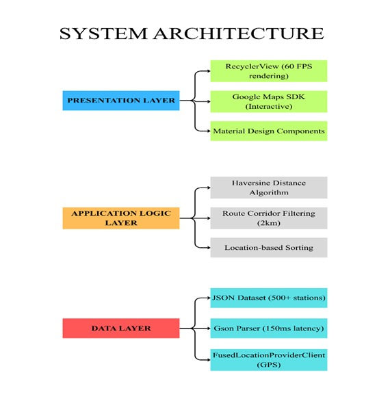
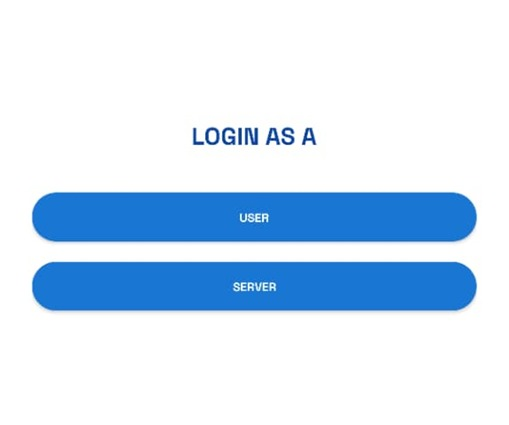
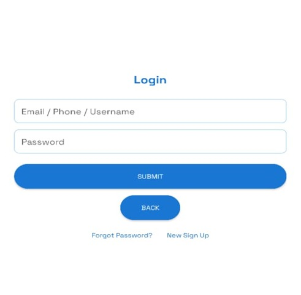
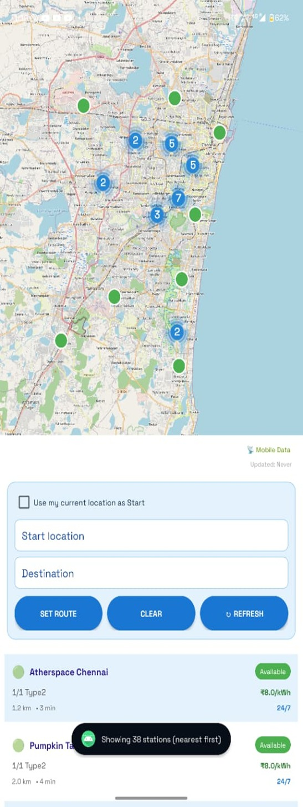
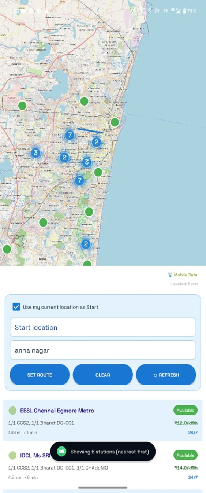
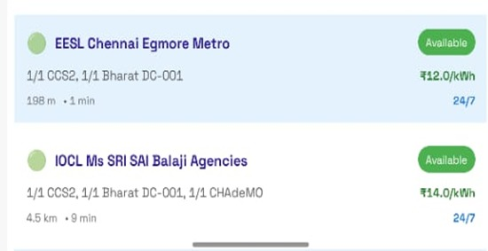
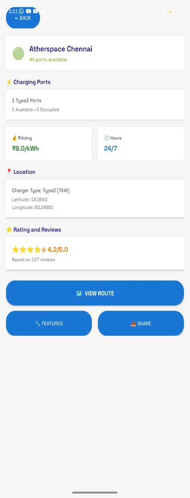
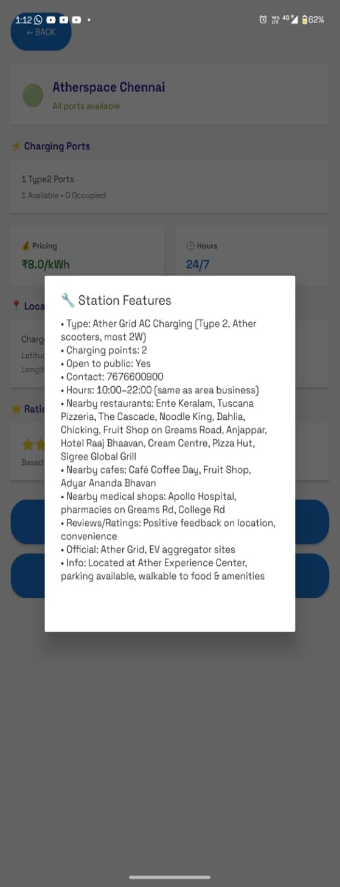
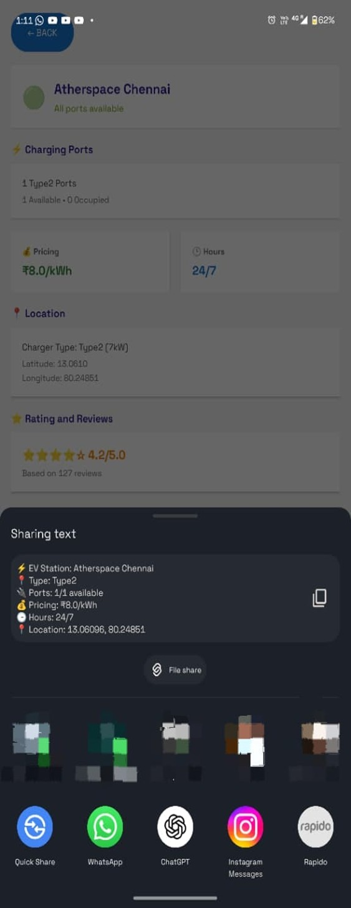

# EV Charging App – Screenshots

This folder contains the main screenshots and system architecture of the EV Charging App.

## Image Files

```text
Screenshots/
├── fig_01.jpeg
├── fig_02.jpeg
├── fig_03.jpeg
├── fig_04.jpeg
├── fig_05.jpeg
├── fig_06.jpeg
├── fig_07.jpeg
├── fig_08.jpeg
├── fig_09.jpeg
└── README.md
```

---

## Fig. 1 – System Architecture

<p align="center">
  
</p>

<p align="center">
  <em>Fig. 1. Three-layer architecture of the EV Charging App, consisting of the presentation layer, application logic layer and data layer.</em>
</p>

---

## Fig. 2 – Role Selection Screen

<p align="center">
  
</p>

<p align="center">
  <em>Fig. 2. Role-selection screen that allows the user to choose between User and Server modes.</em>
</p>

---

## Fig. 3 – User Login Screen

<p align="center">
  
</p>

<p align="center">
  <em>Fig. 3. Login screen where users can enter their email, phone number or username and password.</em>
</p>

---

## Fig. 4 – Charging-Station Dashboard

<p align="center">
  
</p>

<p align="center">
  <em>Fig. 4. Main dashboard displaying charging stations on the map and a list of nearby stations sorted by distance.</em>
</p>

---

## Fig. 5 – Route-Based Station Search

<p align="center">
  
</p>

<p align="center">
  <em>Fig. 5. Route-search screen showing charging stations available near the selected destination.</em>
</p>

---

## Fig. 6 – Charging-Station List

<p align="center">
  
</p>

<p align="center">
  <em>Fig. 6. Charging-station list displaying station name, charger type, distance, travel time, availability, price and operating hours.</em>
</p>

---

## Fig. 7 – Station Details Screen

<p align="center">
  
</p>

<p align="center">
  <em>Fig. 7. Detailed station screen showing port availability, pricing, operating hours, location, rating and navigation options.</em>
</p>

---

## Fig. 8 – Station Features

<p align="center">
  
</p>

<p align="center">
  <em>Fig. 8. Station-features window displaying charger information, contact details, opening hours and nearby facilities.</em>
</p>

---

## Fig. 9 – Share Station Details

<p align="center">
  
</p>

<p align="center">
  <em>Fig. 9. Android sharing interface used to share the selected charging station's details through supported applications.</em>
</p>

---

## Summary

The screenshots demonstrate the main functions of the EV Charging App, including:

- User and server role selection
- User authentication
- Charging-station map display
- Location-based station sorting
- Route-based station filtering
- Station availability and pricing
- Detailed station information
- Nearby facilities
- Station-information sharing
